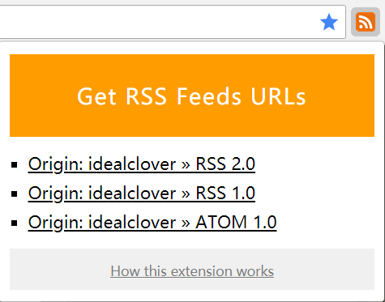
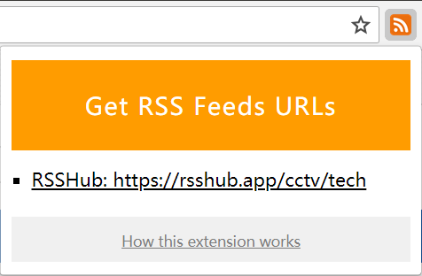

# Easy-to-RSS

> 🚀 RSS IS EASY!

Easy-to-RSS 是一个一键式发现当前网页RSS的 chrome extension，~~计划~~与[RSSHub](https://github.com/DIYgod/RSSHub)联动并支持更多网页。

## Demo

如果该网站自带RSS，Easy-to-RSS将获取该网站自带RSS：

Example website: https://blog.idealclover.top

**同时** 如果该网站被[RSSHub](https://github.com/DIYgod/RSSHub)收录，Easy-to-RSS将获取该网站在RSSHub中的地址：

Example website: http://news.cctv.com/tech/index.shtml

当前支持一键[RSSHub](https://github.com/DIYgod/RSSHub)订阅的网站：

* 3dm game: 完全支持
* Bilibili: 用户投币视频，用户收藏夹
* GitHub: issues
* 简书: 完全支持
* 知乎：完全支持
* 微博：完全支持

## How to Use

> 项目还出于demo开发阶段，especially 对RSSHub的支持还有bug ，请给 ~~没学过web开发并且学业繁忙甚至不是计算机专业的~~ 作者一点时间！

目前该扩展尚未在 chrome store 上架，需要下载并打包为.ctx格式。

## Planned Features

- [ ] Click to copy
- [ ] Add RSSHub routers
- [ ] Configure RSSHub root URL
- [ ] Fully compatible with RSSHub
- [ ] More routers and channels

## Contribute

如果有任何想法或需求，可以在 [issue](https://github.com/idealclover/Easy-to-RSS/issues) 中告诉我们，同时我们欢迎各种 pull requests

目前最主要的工作是及时更新 js/popup.js 中的router数据。

## Open-source Licenses

This project is under MIT license, feel free to use it under the license.

Also this project is based on [get-rss-feed-url-extension](https://github.com/shevabam/get-rss-feed-url-extension) and [route-recognizer](https://github.com/tildeio/route-recognizer), and thanks to [RSSHub](https://github.com/DIYgod/RSSHub).

Long live RSS.