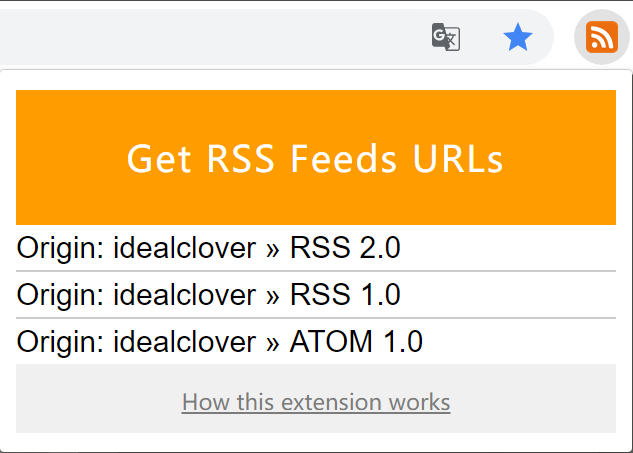
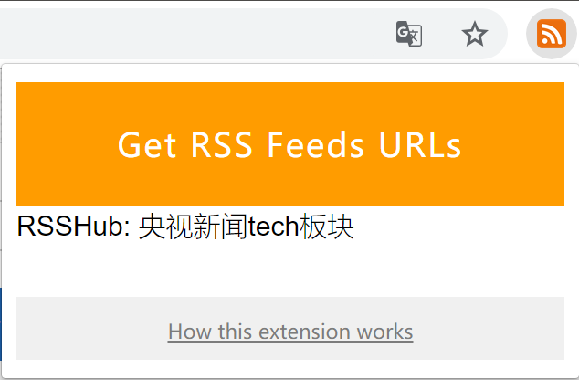
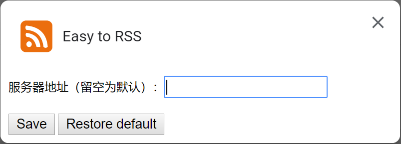

# Easy-to-RSS

> 🚀 RSS IS EASY!

Easy-to-RSS is an one-click chrome/firefox extension to find the RSS of the active tab. This project is related with [RSSHub](https://github.com/DIYgod/RSSHub) so that it can support more websites.

## Demo

Feature: fetch the RSS of the active tab, copy to clipboard and open the RSS URL.

IF the website provides RSS itself, Easy-to-RSS will try to return the original RSS URL of it.

Example website: https://blog.idealclover.top

**AT THE SAME TIME** if the target website can be transferred in [RSSHub](https://github.com/DIYgod/RSSHub), Easy-to-RSS will return the URL in RSSHub router.

Example website: https://twitter.com/idealclover

Now this project support following [RSSHub](https://github.com/DIYgod/RSSHub) websites:

* Instagram：fully supported
* twitter：fully supported
* Youtube: fully supported
* GitHub: issues

More Chinese websites, see [Chinese docs](https://github.com/idealclover/Easy-to-RSS).

## How to Use

### Chrome

**Chrome store**

[install](https://chrome.google.com/webstore/detail/easy-to-rss/hbcmpkcpbnecinpngdnfbnknfkdpdfli)

or to search *easy to RSS* in [chrome extension store](https://chrome.google.com/webstore)

**Download the .crx to install**

[v0.1.0 download](https://github.com/idealclover/Easy-to-RSS/releases/download/v0.1.0/Easy-to-RSS.crx)

1. Download *Easy-to-RSS.crx* in [release](https://github.com/idealclover/Easy-to-RSS/releases)
2. Go to *More settings - extensions*
3. Drag the download .crx into chrome, and click to install
4. Finished!

### Firefox

**Firefox addons**

[install](https://addons.mozilla.org/zh-CN/firefox/addon/easy-to-rss/)

### Examples

> Tips: open link in new tab is not supported in Github mark-down. It is  recommended to use **ctrl** + click to open the following links in new tab.

The following example is provided by **RSSHub**:

* Github: [Issues](https://github.com/idealclover/Easy-to-RSS/issues)
* Instagram: [User](https://www.instagram.com/snatti89/)
* Twitter: [User](https://twitter.com/idealclover)
* Youtube: [User](https://www.youtube.com/user/crashcourse) [Channel](https://www.youtube.com/channel/UCX6b17PVsYBQ0ip5gyeme-Q)

More Chinese websites, see [Chinese docs](https://github.com/idealclover/Easy-to-RSS).

**And** here are some websites provides original RSS:

* ~~For my girlfriend~~ Lofter: [Blog](http://idealclover.lofter.com/)
* Reddit: [Home](https://www.reddit.com/) [Topic](https://www.reddit.com/r/changemyview/)

**More important**, you can custom the address of RSSHub server. **It is  recomended to run RSSHub on your own server**

## Planned Features

- [x] Click to copy
- [ ] Add RSSHub routers
- [x] Configure RSSHub root URL
- [ ] Fully compatible with RSSHub
- [ ] More routers and channels

## Contribute

If you have any suggestions, send issues [here](https://github.com/idealclover/Easy-to-RSS/issues), and welcome pull requests.

## Open-source Licenses

This project is under MIT license, feel free to use it under the license.

Also this project is based on [get-rss-feed-url-extension](https://github.com/shevabam/get-rss-feed-url-extension) and [route-recognizer](https://github.com/tildeio/route-recognizer), and thanks to [RSSHub](https://github.com/DIYgod/RSSHub).

Long live RSS.
